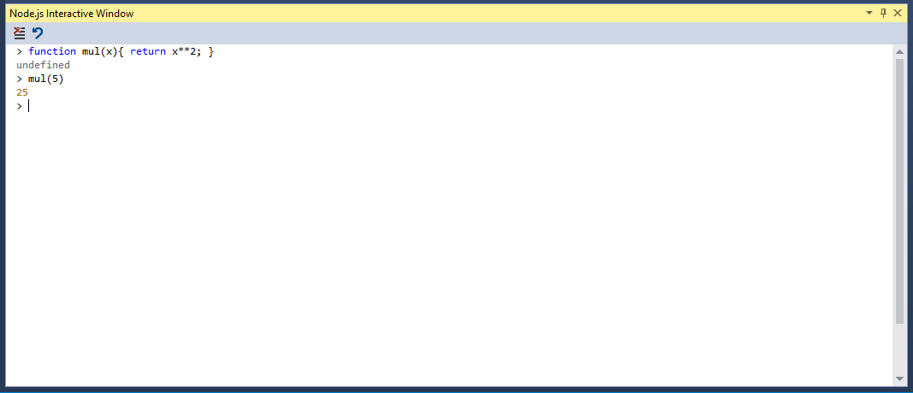
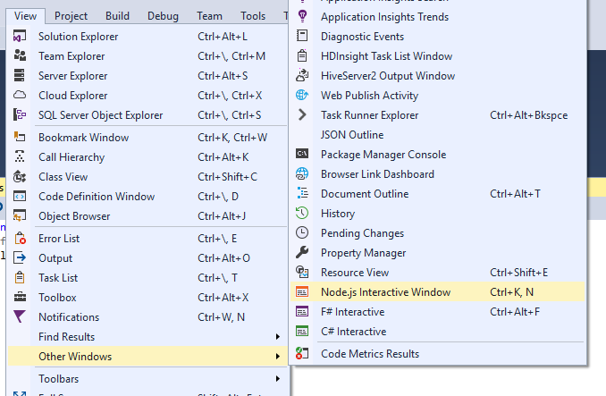
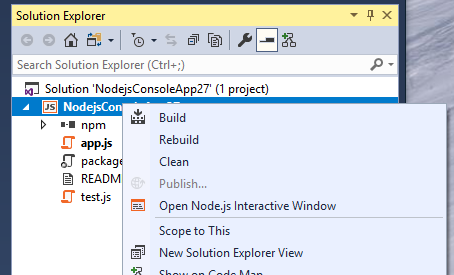

# The Node.js interactive window

Node.js Tools for Visual Studio includes an interactive window for the installed Node.js runtime. This allows you
to enter JavaScript and see the results immediatly, as well as execute npm commands to interact with the current 
project. The interactive window is also known as a REPL (**R**ead/**E**valuate/**P**rint **L**oop).

## Opening the interactive window

The default short-cut keys for the Node.js interactive window are [CTRL] + K, N.

You can also find it in the View - Other Windows menu.

And finally you can Right-Click on the Node.js project node, and select the interactive window.

## Commands

The interactive window has several built-in commands, which start with a dot prefix, to distinguish them from 
any JavaScript function you declare.

### .cls, .clear
Clears the contents of the editor window, leaving history and execution context intact.

### .help
Display help on specified command, or all available commands and key bindings if none specified.

### .info
Show information about the current used Node.js executable.

### .npm
Executes npm command. If solution contains multiple projects, specify target project using `.npm [ProjectName] <npm arguments>`

### .reset
Reset the execution environment to the initial state, keep history.

### .save
 Save the current REPL session to a file.
 